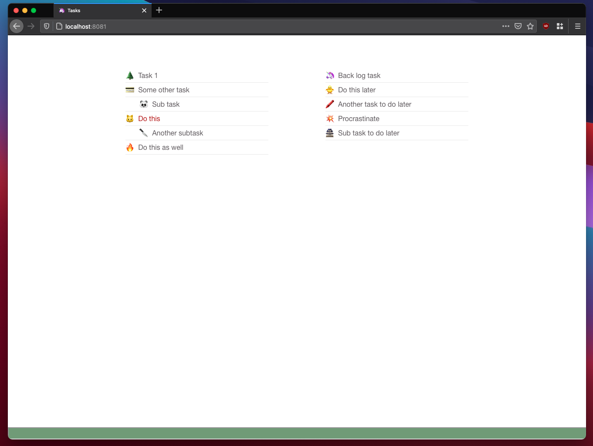

# Anduril

Stupid task manager. Work with just your keyboard.

## Keyboard shortcuts

Navigation
- `j` down
- `k` up
- `h` left
- `l` right

Actions
- `t` create new task under "today"
- `b` create new task under "backlog"
- `s` create a subtask
- `x` mark task as done
- `d` delete a task
- `ctrl + d` delete all completed tasks




## Installation

```
$ npm install
$ npm run serve
```
